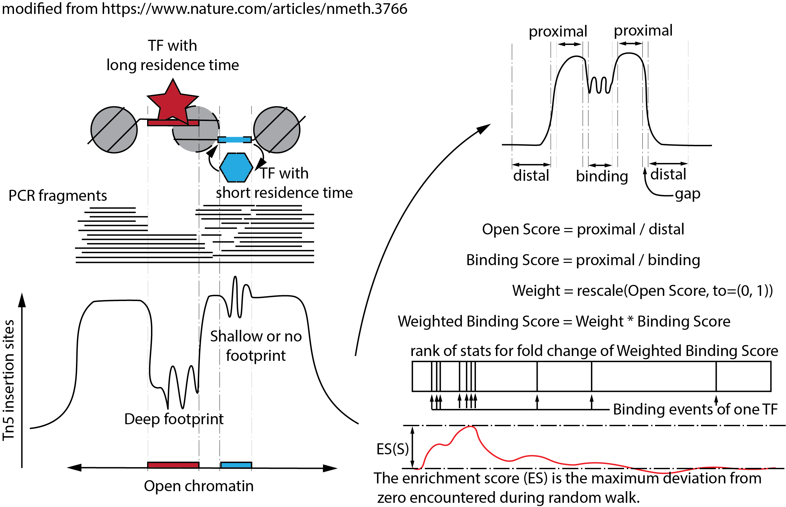

# ATACseqTFEA

[](http://bioconductor.org/packages/devel/bioc/html/ATACseqTFEA.html)
[](http://bioconductor.org/packages/devel/bioc/html/ATACseqTFEA.html)

Transcription Factor Enrichment Analysis for ATAC-seq

Assay for Transpose-Accessible Chromatin using sequencing (ATAC-seq) is a
technique to assess genome-wide chromatin accessibility by probing open
chromatin with hyperactive mutant Tn5 Transposase that inserts sequencing
adapters into open regions of the genome. ATACseqTFEA is a improvement of
current computational method that detects differential activity of transcription
factors (TFs). ATACseqTFEA not only use the difference of open region
information, but also (or emphasize) the difference of TFs
footprints (cutting sites or insertion sites).

ATACseqTFEA provides an easy, rigorous way to broadly assess TF activity changes
between two conditions.



## Installation

To install this package, start R and enter:

```r
library(BiocManager)
BiocManager::install("ATACseqTFEA")
```

## Documentation

To view documentation of ATACseqTFEA, start R and enter:
```r
browseVignettes("ATACseqTFEA")
```

## Contributions and Support

If you would like to contribute to this package, the standard workflow is as follows:

1. Check that there isn't already an issue about your idea in the [jianhong/ATACseqTFEA/issues](https://github.com/jianhong/ATACseqTFEA/issues) to avoid duplicating work. If there isn't one already, please create one so that others know you're working on this
2. [Fork](https://help.github.com/en/github/getting-started-with-github/fork-a-repo) the [jianhong/ATACseqTFEA](https://github.com/jianhong/ATACseqTFEA) to your GitHub account
3. Make the necessary changes / additions within your forked repository following [Bioconductor contribution](https://contributions.bioconductor.org/)
4. Use `devtools::build` and `devtools::check` to check the package work properly.
5. Submit a Pull Request against the `master` or current `RELEASE_VERSION` branch and wait for the code to be reviewed and merged

If you're not used to this workflow with git, you can start with some [docs from GitHub](https://help.github.com/en/github/collaborating-with-issues-and-pull-requests) or even their [excellent `git` resources](https://try.github.io/).

For further information or help, don't hesitate to get in touch on the [Bioconductor support site](https://support.bioconductor.org/).

## Reporting bug/issues

Many thanks for taking an interest in improving Bioconductor package ATACseqTFEA. Please report bug/issues at [jianhong/ATACseqTFEA/issues](https://github.com/jianhong/ATACseqTFEA/issues).
